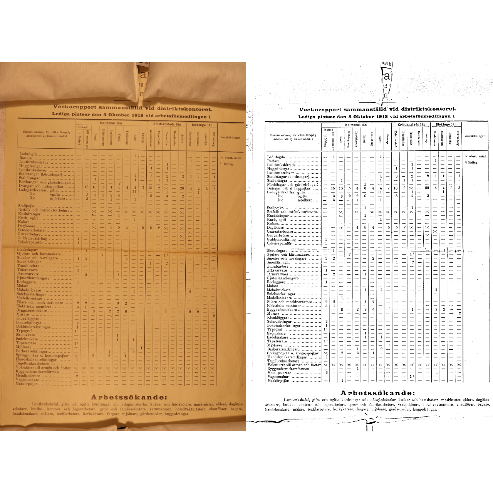
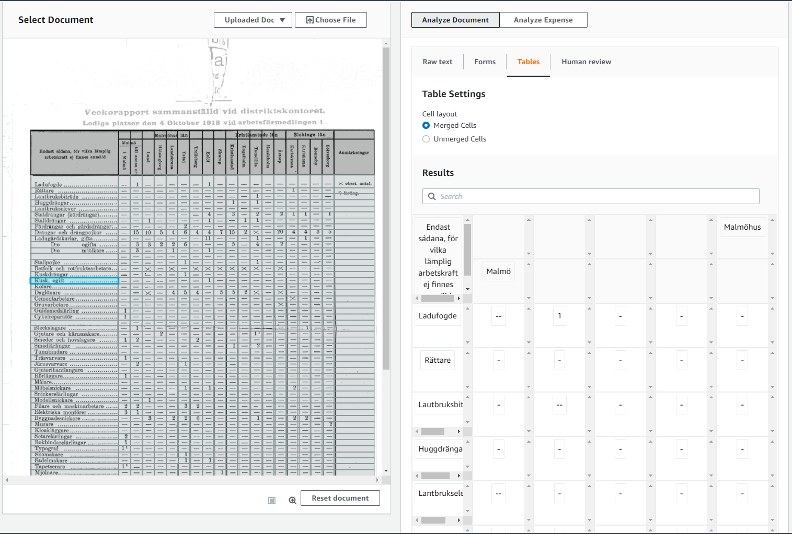

```{r setup, include=FALSE}
knitr::opts_chunk$set(echo = FALSE, message = F, warning = F)
library(tidyverse)
```

# Workplan for RA 

## Introduction

Hej John,

Thank you for being interested in working as a research assistant on this project. We're excited to have you on board!

The purpose of this document is to provide you some information on the project, your role, and the work which we would love some help with.

We want to make sure that this is an enriching experience for you and us and would like to involve you in analysing some the data which you gather, in addition to the photographs that you will take.

## Overview

The purpose of digitizing the vacancy lists is to understand labour market dynamics in Sweden. One proposed project was to look at the rate of turnover of new jobs in Sweden, and the drop off in other jobs. Tracking the inclusion of titles on the lists could be a good way to quantify this.

The purpose is laid out in the presentation below:

```{r}
knitr::include_url("https://j-jayes.github.io/swedish-patent-data/#1")
```

To digitize the content of the vacancy lists, there are three steps:

1. Photographing the lists
2. Processing the photographs
3. Extracting the data from the processed images.

We would like help in taking the photographs of the list so that other team members can devote time to the pipeline for processing the images and extracting the data.

## Data descripton

The lists are held in the Lund University library. The document below explains the data source in more detail:

```{r}
knitr::include_url("https://j-jayes.github.io/PhD-Ideas-2/")
```

## Photographing

The photo set up comprises a table with camera stand and lights, as well as a camera. The table belongs to the Library. It is available to use in the Special Collections Reading Room. The bed of the set up fits an A3 sized sheet. Riksvakanslistor extend beyond the edges of the bed. I need to get a flat board and a screen to photograph these.

The camera and automatic clicker belong to me. The automatic clicker is super useful because you don't get any camera shake.

```{r, out.width="60%"}
knitr::include_graphics("https://raw.githubusercontent.com/j-jayes/swedish-patent-data/main/slides/camera_set_up.jpeg")
```

### Photographing timeline

With the set up above, it takes an hour to do 100 photographs. There is scope for increasing speed slightly with the screen covering the sheet instead of a page.

For Riksvakanslistan, there are records from 1916 to 1958. One sheet is produced each week, each sheet has two sides. The cell below shows it will take just less than 45 hours.

```{r, echo=T}

years = 1958-1916 + 1

lists_per_year = 52

sides_per_list = 2

total_photos = years * lists_per_year * sides_per_list

photos_per_hour = 100

hours = total_photos / photos_per_hour

hours
```

For the Distrikvakanslistan, it's similar. Two sheets are produced each week, but they are one sided. The same calculations hold. We should gather data at the district level for the counties which lie along the main electricity line. These are:


## Data management

Photos stored on OneDrive in folder by date taken.

## Post-processing

The raw photographs need to be processed such that the OCR software is effective. This involves a few different steps:

- Straighten the image
- Dewarp the image as the camera lens introduces a warp at shallow focal lengths
- Crop the image so that only the region of interest remains
- Enhance the edges of characters and lines such that OCR can clearly distinguish these
- Binarize the image to just two colours. The character recognition engines are trained on images with only black and white and so work best when the photographs are binarized.

I demonstrate these below.

```{r}
knitr::include_url("https://j-jayes.github.io/swedish-patent-data/?panelset4=pre-processing-image#33")
```

An improvement on the method shown above includes a dewarping procedure that is more complex. This method performs well on tabular data by straightening the lines between entries in each column and row.

As you see in the image below, The lines are straightened and the shadowy section caused by the crease in the centre of the page is removed.

```{r}

```


## Make machine readable data

OCR and tabular data.

### OCR for metadata and free text

Each sheet has information which we want to capture - primarily the tabular vacancy data - but in addition, the date on which the list was published, amongst other things.

So the first task is to extract from the text on the page important metadata like dates, via OCR.

This should be relatively easy. I haven' done it yet.

### Tabular data pipeline

The largest challenge so far as been to take the output of the AWS textract, turn it into a table and export it as e.g. a CSV file.

The results from the AWS textract module are sent in JSON format. They contain coordinates for each line, polygon, piece of text and table border. An example is shown below.

```{r}
library(jsonlite)
json_raw <- read_json("resources/05-document-processing/IMG_example.json")

listviewer::jsonedit(json_raw)
```

AWS textract can see the cells - they are correctly identified and split by content:

```{r, out.width="80%"}

```

Yet exporting them to CSV has remained tricky. I need to learn a bit more about parsing JSON files in order to write some logic to segment the tables better. For example, we know the rows comes in two types - a wide cell with the occupations and then narrow cells with numbers. We know what the content of the cells must be - so some formal logic will help to get the tables into the correct shape.


